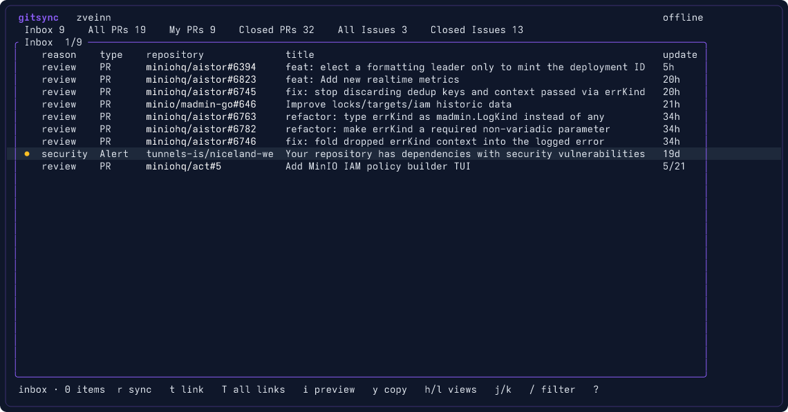
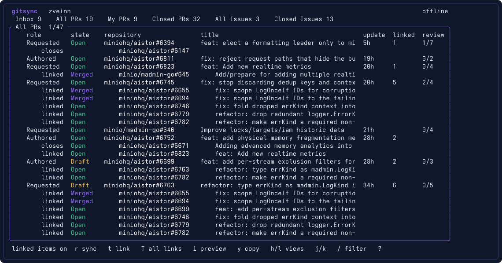
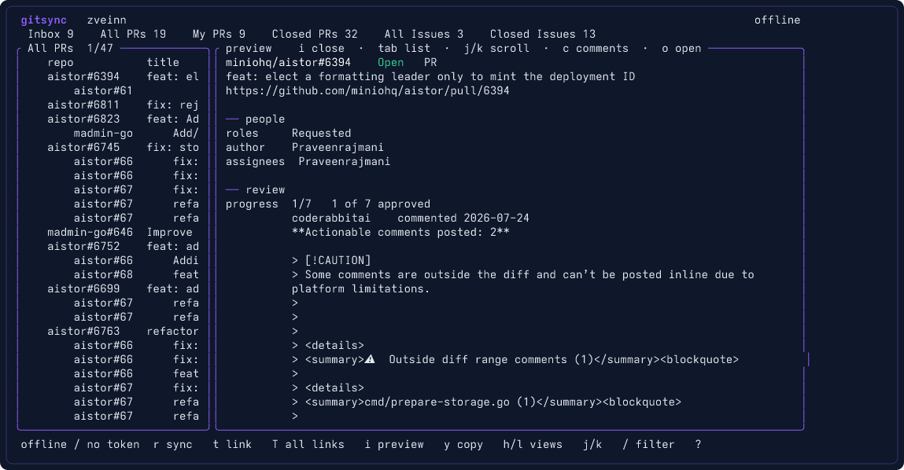

# xgit

A local-first TUI for the GitHub issues and pull requests you are actually
involved in.

## Install

Download the Linux, Windows, or macOS binary from the
[latest release](https://github.com/zveinn/xgit/releases/latest).

Or build from source:

```bash
cargo build --release
# binary: target/release/xgit
```

A GitHub token is needed for sync (the TUI still opens offline from the local
cache). Classic PAT or fine-grained:

- `repo` — private repos you care about
- `notifications` — recommended for incremental poll
- `read:user` — enough to resolve your login

`read:org` is not required.

Set the token in any of:

1. `GITHUB_TOKEN` / `GH_TOKEN` / `GITHUB_ACTIVITY_TOKEN`
2. `~/.gitsync/token`
3. `token = "..."` in `~/.gitsync/config.toml`
4. The existing `~/.github-feed/.env` (read as a fallback, never overwritten)

```bash
xgit                 # TUI (syncs in the background)
xgit --offline       # TUI, local database only
xgit sync            # one incremental poll, print a summary
xgit sync --full     # force the 3-query backfill
xgit stats           # local counts
```

## Screenshots

Inbox — review requests, assignments, and GitHub notifications, newest first.



All PRs — open PRs you authored or were asked to review, with linked issues nested (`T`).



Preview — `i` opens a right-hand pane with people, review progress, and the body.



## Menus

| Menu | What it shows |
|------|----------------|
| **Inbox** | GitHub notifications plus open work waiting on you: review requests, assignments that are not yours, mentions. Sorted by last update. |
| **All PRs** | Open pull requests you authored or were asked to review. `t` nests linked issues under the selected PR; `T` does that for the whole list. |
| **My PRs** | Open pull requests you authored. |
| **Closed PRs** | Closed and merged pull requests. Time filter applies (`r` sync windows). |
| **All Issues** | Open issues you are involved in. Linked PRs nest under an issue the same way issues nest under PRs. |
| **Closed Issues** | Closed issues, with the same linked-PR nesting. |

Move between menus with `h` / `l` (or the arrow keys).

| Key | Action |
|-----|--------|
| `h` `l` | Previous / next menu |
| `j` `k` | Move in the list (or scroll the preview when it is focused) |
| `i` | Open / close the right preview |
| `tab` | Toggle list / preview focus |
| `esc` | Close the preview |
| `/` | Filter title, repo, author, number |
| `r` | Sync menu: this item, created last 7/30/60/90 days, or all |
| `t` | Toggle linked items for the selected PR/issue |
| `T` | Toggle linked items for the whole list |
| `y` | Copy the GitHub URL (works over SSH) |
| `o` / `enter` | Open in browser |
| `c` | Fetch comments for the selected item |
| `?` | Help |
| `q` | Quit |

## License

MIT
