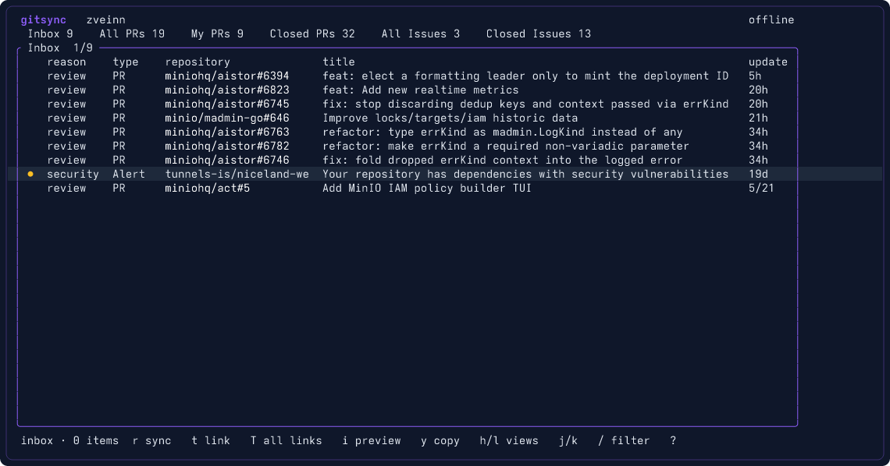
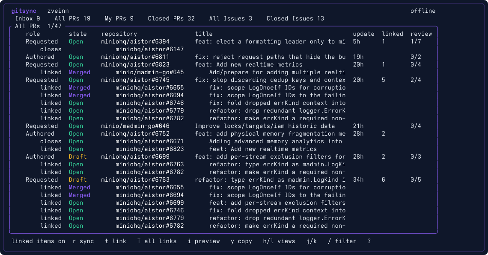
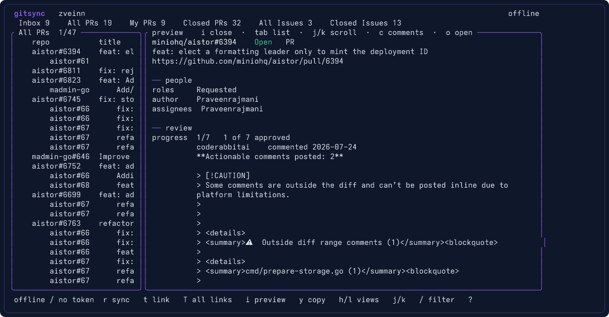

# xgit

A local-first TUI for the GitHub issues and pull requests you are actually
involved in.

## Install

Download the Linux, Windows, or macOS binary from the
[latest release](https://github.com/zveinn/xgit/releases/latest).

Or build from source:

```bash
cargo build --release
# binary: target/release/xgit
```

A GitHub token is needed for sync (the TUI still opens offline from the local
cache). Classic PAT or fine-grained:

- `repo` — private repos you care about
- `notifications` — recommended for incremental poll
- `read:user` — enough to resolve your login

`read:org` is not required.

Set the token in any of:

1. `GITHUB_TOKEN` / `GH_TOKEN` / `GITHUB_ACTIVITY_TOKEN`
2. `~/.gitsync/token`
3. `token = "..."` in `~/.gitsync/config.toml`
4. The existing `~/.github-feed/.env` (read as a fallback, never overwritten)

```bash
xgit                 # TUI (syncs in the background)
xgit --offline       # TUI, local database only
xgit sync            # one incremental poll, print a summary
xgit sync --full     # force the 3-query backfill
xgit stats           # local counts
```

## Screenshots

Inbox — review requests, assignments, and GitHub notifications, newest first.



All PRs — open PRs you authored or were asked to review, with linked issues nested (`T`).



Preview — `i` opens a right-hand pane with people, review progress, and the body.



## Menus

| Menu | What it shows |
|------|----------------|
| **Inbox** | GitHub notifications plus open work waiting on you: review requests, assignments that are not yours, mentions. Sorted by last update. |
| **All PRs** | Open pull requests you authored or were asked to review. `t` nests linked issues under the selected PR; `T` does that for the whole list. |
| **My PRs** | Open pull requests you authored. |
| **Closed PRs** | Closed and merged pull requests. Time filter applies (`r` sync windows). |
| **All Issues** | Open issues you are involved in. Linked PRs nest under an issue the same way issues nest under PRs. |
| **Closed Issues** | Closed issues, with the same linked-PR nesting. |
| **Seen Repos** | Every repo in the local cache, most open PRs first. `enter` opens one. |
| **My Repos** | Every repo you own, most open PRs first. |

Move between menus with `h` / `l` (or the arrow keys).

## Repos

Both repo menus use the same columns and sort by open PRs, so the busiest repo
is on top — they differ only in where the rows and counts come from.

`open PRs` counts **human authors only**. Dependabot gets its own `deps`
column, and the sort keys off the human count first, then open issues, so a
repo buried in dependency bumps cannot outrank one with real work waiting. The
preview (`i`) shows the split and the combined total.

**Seen Repos** is the local cache: repos xgit has an issue or PR for, counted
by **your involvement** rather than the repository totals.

**My Repos** is the list of repos you own personally, fetched from GitHub the
first time you open the tab (`r` → *this item* refetches) and cached locally
after that. Its open PR and issue counts are GitHub's **repo-wide** totals;
`unread` still comes from your cache. Org repos and repos you only contribute
to are not owned, so they only appear under Seen Repos.

The Dependabot split samples up to 100 open PRs per repo. Past that the
authors are not inspected and the remainder counts as human, so a repo with
more than 100 open PRs under-reports `deps` rather than guessing.

`enter` on a repo in either menu replaces the top menu with a bar for that
repo: its name on the far left, then its own `PRs`, `Issues`, and `Actions`
tabs. `h` / `l` moves between those three, `esc` goes back to the menu you came
from with that repo still selected.

`PRs` and `Issues` list everything cached for that repo — open first, then
closed and merged — regardless of how you are involved. `Actions` lists the 30
most recent workflow runs, fetched from GitHub the first time you open the tab
(`r` → *this item* refetches) and cached locally after that.

| Key | Action |
|-----|--------|
| `h` `l` | Previous / next menu (repo tabs inside a repo) |
| `j` `k` | Move in the list (or scroll the preview when it is focused) |
| `i` | Open / close the right preview |
| `tab` | Toggle list / preview focus |
| `esc` | Close the preview, then leave the repo |
| `/` | Filter title, repo, author, number |
| `r` | Sync menu: this item, created last 7/30/60/90 days, or all |
| `t` | Toggle linked items for the selected PR/issue |
| `T` | Toggle linked items for the whole list |
| `y` | Copy the GitHub URL (works over SSH) |
| `o` | Open in browser |
| `enter` | Open in browser — or open the repo, on a Repos row |
| `c` | Fetch comments for the selected item |
| `?` | Help |
| `q` | Quit |

## License

MIT
