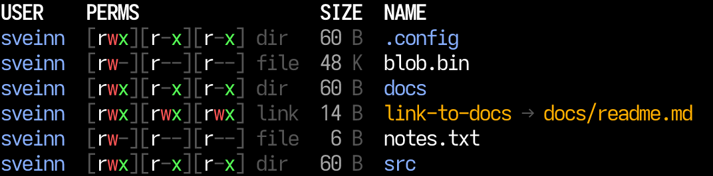
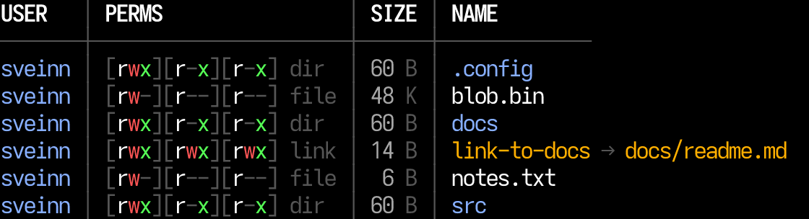
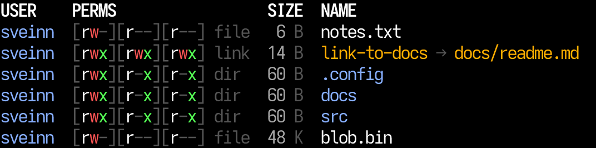
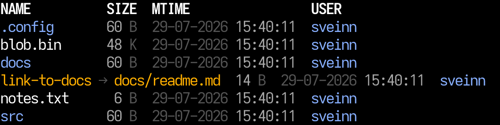
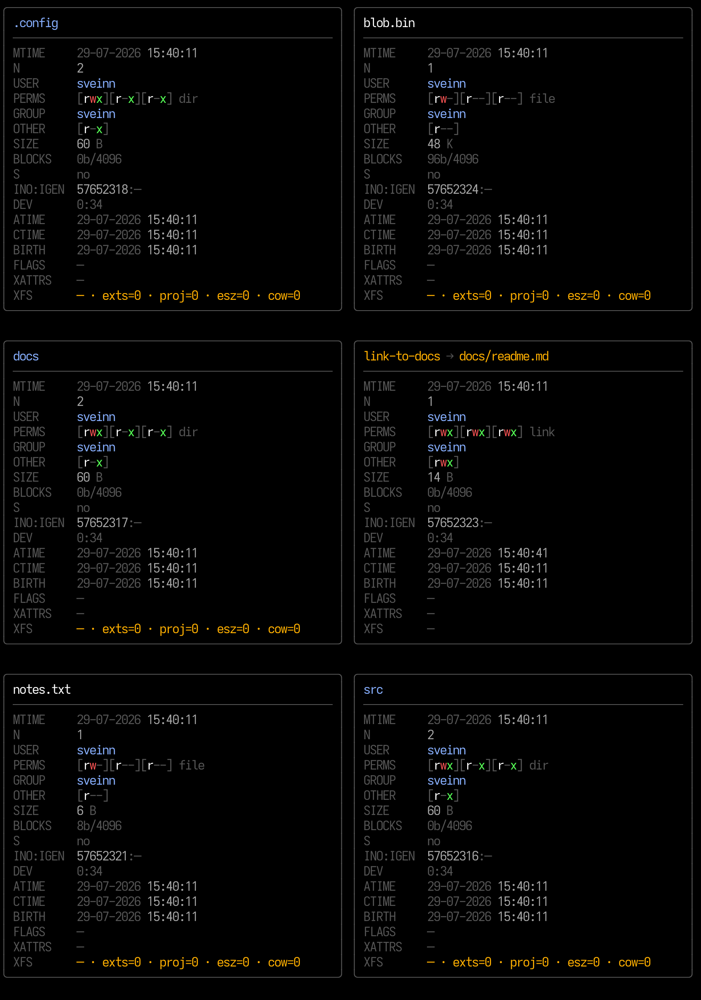

# xls

A colorful, modern directory listing for Linux.

## Screenshots

**Default** (`xls --noTable`)



**Table frame** (`xls`)



**Sort by size** (`xls --sort SIZE --noTable`)



**Custom columns** (`xls --columns NAME,SIZE,MTIME,USER --noTable`)



**Card layout** (`xls --cards`)



## Install

Download the binary for your architecture from the
[latest release](https://github.com/zveinn/xls/releases/latest):

| Arch | Asset |
|------|--------|
| x86_64 | `xls-*-linux-x86_64.tar.gz` |
| aarch64 | `xls-*-linux-aarch64.tar.gz` |

```bash
# Example: x86_64
curl -sL https://github.com/zveinn/xls/releases/latest/download/xls-v0.0.1-linux-x86_64.tar.gz \
  | tar -xz
sudo install -m 755 xls-v0.0.1-linux-x86_64 /usr/local/bin/xls
xls --help
```

Replace the version and arch to match the asset you downloaded. Optional
checksums (`.sha256`) are published next to each archive.

### Build from source

```bash
cargo install --path .
# or
cargo build --release
```

## Examples

```bash
# Default listing (USER, PERMS, SIZE, NAME)
xls

# List a path
xls /var/log

# Several paths, or a shell glob (the shell expands it into separate paths)
xls src/*.rs
xls x* --sort MTIME

# Everything
xls --all

# Card layout
xls --cards
xls --all --cards

# Pick columns and order
xls --columns NAME,SIZE,MTIME
xls --columns USER,PERMS,NAME /home

# Sort (always ascending)
xls --sort SIZE
xls --all --sort MTIME

# Plain layout / no header
xls --noTable
xls --noHeaders --sort NAME

# Pagers
xls | less
xls --color=always | less -R
```

## CLI flags

| Flag | Description |
|------|-------------|
| `--all` | Show every column in a fixed sensible order |
| `--columns COLS` | Comma-separated columns to show, in order (`--columns=…` also works) |
| `--sort COL` | Sort by column, ascending (`--sort=…` also works) |
| `--cards` | Bordered cards instead of a table (grid when space allows) |
| `--noHeaders` | Do not print the column header row |
| `--noTable` | Skip table frame (`│` / `─┼─` rules) |
| `--color WHEN` | `auto` (default), `always`, or `never` |
| `-h`, `--help` | Show help |

**Notes**

- `--all` and `--columns` cannot be used together.
- Any number of paths may be given. Non-directories are listed first in one table, then each directory gets its own labelled section (`path:`), like `ls`. Labels appear only when more than one path is given. Paths are shown as typed (minus any trailing slash), so `xls */*.md` stays unambiguous.
- An unreadable path is reported on stderr and skipped; the remaining paths are still listed and the exit status is non-zero.
- Color is off when stdout is not a TTY (e.g. pipes). Also respects `NO_COLOR`, `CLICOLOR=0`, and `CLICOLOR_FORCE` / `FORCE_COLOR`.
- `--cards` renders each entry as a bordered card (multiple per row when space allows).

## Columns

Default: `USER`, `PERMS`, `SIZE`, `NAME`.

| Column | Description |
|--------|-------------|
| `MTIME` | Last content modification time (UTC, `DD-MM-YYYY HH:MM:SS`) |
| `USER` | Owner identity (`sveinn`, or `sveinn/staff` when group differs) |
| `PERMS` | Permission triads + type: `[rwx][r-x][r-x] dir` (user / group / other / type; trailing `+` ACL or `@` xattrs) |
| `GROUP` | Group name only |
| `OTHER` | Other-class triad only, e.g. `[r-x]` |
| `SIZE` | Logical size, human-readable (`B` / `K` / `M` / `G` / `T`) |
| `NAME` | Entry name (color indicates type); symlinks show `→ target` |
| `N` | Hard link count |
| `BLOCKS` | Allocated blocks and I/O block size (`<st_blocks>b/<blksize>`) |
| `S` | Sparse flag (`◆` / `◇` in table mode; `yes` / `no` in cards) |
| `INO:IGEN` | Inode number and generation (when available) |
| `DEV` | Device id (`major:minor`); device nodes also show `rdev` |
| `ATIME` | Last access time (may be stale on `noatime` mounts) |
| `CTIME` | Last status-change time (metadata change, not create) |
| `BIRTH` | Creation / birth time when the filesystem provides it |
| `FLAGS` | Linux inode flags from `FS_IOC_GETFLAGS`, or `—` |
| `XATTRS` | Extended attribute names, or `—` |
| `XFS` | Cheap XFS info (`FS_IOC_FSGETXATTR` / `DIOINFO`): xflags, exts, proj, esz, cow, dio |

**Aliases** (for `--columns` / `--sort`): `MODIFIED`→`MTIME`, `OWNER`/`UID`→`USER`, `GID`→`GROUP`, `MODE`/`PERMISSIONS`→`PERMS`, `NLINK`/`LINKS`→`N`, `ALLOC`→`BLOCKS`, `SPARSE`→`S`, `INODE`/`INO`/`IGEN`→`INO:IGEN`, `DEVICE`→`DEV`, `ACCESSED`→`ATIME`, `CHANGED`→`CTIME`, `BTIME`/`CREATED`→`BIRTH`, `FL`→`FLAGS`, `XA`/`XATTR`→`XATTRS`.
