# xmux

A minimal terminal multiplexer built on [`libghostty-vt`](https://crates.io/crates/libghostty-vt),
the terminal emulation engine extracted from [Ghostty](https://ghostty.org).
Client/server like tmux: a long-lived server owns **sessions → tabs →
panes**, thin clients attach over a Unix socket — sessions survive SSH
disconnects, reattach and everything is as you left it.

## Supports agents

LLM agents get a first-class, non-interactive control surface — one-shot
commands over the socket, no pty, no keystroke faking:

```sh
xmux agent new    build              # create an agent session (or: new build <tab>)
xmux agent send   build 'cargo test' # type text + Enter into it ([-t tab])
xmux agent read   build              # the rendered screen, as plain text ([-t tab])
xmux agent rename build tests        # short, descriptive names
xmux agent kill   build              # kill a session (or: kill build <tab>)
```

Agent sessions are sandboxed by design: the agent commands **refuse to
touch your sessions**. They live in their own list, sorted by activity
and tagged with a last-activity age — press **`a`** in the session
manager to check on your agents, or attach with `xmux a <name>`; they
are normal sessions underneath. A ready-made Claude Code skill ships in
[`.claude/skills/xmux/`](.claude/skills/xmux/SKILL.md).



## Install

Grab the latest Linux build (`amd64` or `arm64`) from the
[zveinn/tools releases](https://github.com/zveinn/tools/releases). The
assets are `xmux-<tag>-linux-amd64.tar.gz` and
`xmux-<tag>-linux-arm64.tar.gz`:

```sh
# arm64: same commands with linux-arm64 in the name
tar xzf xmux-v*-linux-amd64.tar.gz && cd xmux-v*-linux-amd64
sudo install -m755 xmux /usr/local/bin/
```

Then run the server as a systemd system service. It starts at boot and
survives SSH logouts. The unit file ships in the tarball and in this
repo, and it needs two edits before it will start:

- Set `User=` (it ships as `[YOUR_USER]`) to your username.
- `ExecStart` ends in `--config [PATH_TO_CONFIG_DIR (optional)]`.
  Delete that `--config` argument to use `~/.config/xmux`, or replace
  the placeholder with a real directory.

```sh
sudo cp xmux.service /etc/systemd/system/
sudo systemctl daemon-reload
sudo systemctl enable --now xmux
```

To build from source: `cargo install --path .`. That needs Rust 1.90+,
Zig 0.15.2, and `git` on PATH. `libghostty-vt` compiles Ghostty from
source, and the release build pins Zig 0.15.2 because that Ghostty
tree rejects other Zig versions. Cargo installs the binary to
`~/.cargo/bin`; the unit file runs `/usr/local/bin/xmux`, so copy it
there or point `ExecStart` at the Cargo path.

```sh
xmux a work    # attach to session "work", creating it if new
xmux list      # sessions, including stopped pins: tabs, panes, attach state, agent ages
```

Detach with **Ctrl+G** (or drop the SSH connection — the session keeps
running). The socket lives beside the config, at `~/.config/xmux/xmux.sock`
(`XMUX_SOCK` overrides); server logs land in `journalctl -u xmux`. Run the server
with `--config <dir>` to keep `config.yaml` and `layout.json` in a
custom directory instead of `~/.config/xmux/`.

## Config

`~/.config/xmux/config.yaml` — created from the built-in defaults on
first run, and **hot-reloaded** within about a second of saving (a
broken config is rejected and the old one stays active). Shown here
with sample `start_dir`, `commands`, and `sessions`. A command chord
has to be free: the same sequence bound twice (a command and a
keybinding, or two commands) is rejected.

```yaml
accent: "#7aa2f7"

# one letter of a working session name, then the chip background after
# that agent finishes a turn, until you view the session
agent_color_highlight: "#a855f7"

shell: /usr/bin/bash

# where new shells start; unset or empty = your home directory
start_dir: ~/code

# lines of scrollback kept per pane
scrollback_lines: 5000

# mouse select-to-copy (clipboard via OSC 52, works over SSH)
select_copy: true

# status bar position: bottom (default) or top.
# sessions sit on the left, tabs of the active session on the right.
# when the two would overlap, the tabs move up a line.
bar_position: bottom

terminal_envs:
  TERM: xterm-256color

# chords that type a program + Enter into the focused pane.
# these must not reuse a keybinding (ctrl+h and ctrl+l move focus)
commands:
  alt+h: htop
  alt+g: lazygit

keybindings:
  session-manager: ctrl+o
  tab-manager: ctrl+n
  split-horizontal: ctrl+w
  split-vertical: ctrl+q
  focus-next: ctrl+t
  next-finished: ctrl+a
  focus-left: ctrl+h
  focus-right: ctrl+l
  focus-up: ctrl+k
  focus-down: ctrl+j
  detach: ctrl+g
  fullscreen: ctrl+f
  terminal-settings: ctrl+s

sessions:
  1: { name: project1, key: F1 }
  2: { name: project2, key: F2 }
  3: { name: random, key: F3 }
```

Keys are `[ctrl+][alt+]<char>` or `F1`–`F12`; every binding below is
from this default config and can be remapped. Bound chords are
swallowed by xmux and never reach the inner shell.

## Capabilities

| Capability | Keys / command | Notes |
|---|---|---|
| Sessions | `xmux a <name>` | Created on first attach; survive disconnects; one client per session (a new attach kicks the old) |
| Splits | `ctrl+w` stacked · `ctrl+q` side-by-side | 50/50, with one divider cell between the panes. Ignored when the pane is under 5 rows (stacked) or 5 columns (side by side). The new shell opens in the directory of the pane it was split from. When a shell exits, its sibling takes its space; the last pane closes the tab, and the last tab closes the session |
| Focus | `ctrl+h/j/k/l` directional · `ctrl+t` cycle | Left/right cross tab boundaries, wrapping — tabs form one strip. Up and down stay in the tab. Dividers around the focused pane are accent-colored, with a centered `▸`, `◂`, `▾`, or `▴` on each shared edge pointing into the pane |
| Next finished | `ctrl+a` | Jump to the next normal session whose chip is highlighted: Grok or Claude inside it just finished a turn and no client is looking at its panes. Sessions created with `xmux agent` are left out of the walk. Walks the bar left to right and wraps. Nothing happens when no normal session is highlighted |
| Fullscreen | `ctrl+f` | Focused pane takes the whole area; its tab chip shows `[F]` |
| Scrollback | mouse wheel · `PageUp`/`PageDown` | `scrollback_lines:` per pane (default 5000, max 1000000). The wheel scrolls the pane under the pointer three lines; PageUp/PageDown scroll a page. Typing snaps back to the live end. An app that tracks the mouse gets the events in its own pane. A full-screen app that does not gets three arrow keys per wheel notch, and PageUp/PageDown as page keys |
| Focus by mouse | click (any button) · scroll | Clicking or scrolling a pane focuses it, including panes running mouse-tracking apps — the click still reaches the app. Clicking a session chip switches to that session (a stopped pin starts); clicking a tab chip opens that tab |
| Select to copy | drag | `select_copy:` (default on). Releasing a drag copies the selection to your clipboard via OSC 52 — in-band, so it works across SSH; your terminal must allow OSC 52 writes — and clears the highlight. A click without a drag only focuses the pane. Panes tracking the mouse (vim, htop, lazygit) get the mouse instead |
| Mouse passthrough | automatic | Apps that track the mouse (lazygit, vim, htop) get events in their own pane-local coordinates, re-encoded into the protocol they asked for (SGR, X10, urxvt) and filtered to their tracking mode |
| App clipboard | automatic | OSC 52 yanks from programs inside panes (helix `space+y`, vim) are forwarded to your local clipboard, clipboard/primary register preserved |
| Theme-native colors | automatic | Palette-indexed colors and default fg/bg pass through to your terminal, so panes follow its theme; truecolor is preserved exactly |
| Session manager | `ctrl+o` | `j/k` or `↑/↓` move · `enter` switch · `n` new · `r` rename · `x` kill · `/` search · `esc`, `q`, or `ctrl+o` again close |
| Text prompts | search, name, and settings fields | Full line editing: `←`/`→` move the caret, `Home`/`End`, `Delete`, `Backspace`, `ctrl+a`/`ctrl+e`/`ctrl+u`/`ctrl+w`; long text scrolls. `esc` cancels, `enter` accepts. In a prompt, `ctrl+a` moves to the start of the line and `ctrl+w` deletes a word |
| Agent list | `a` inside the session manager | Toggles to agent sessions only, most-recently-active first, with ages (`5s`, `2m`, `1h`, `3d`). `n` there creates an agent session. `a` again returns to your sessions |
| Tab manager | `ctrl+n` | Same controls as the session manager. `a` does nothing here |
| Pinned sessions | `sessions:` in the config | The number is the slot: it orders the list, and gaps collapse. The key (an F-key, or any other chord) opens the session from anywhere, starting it if needed |
| Commands | `commands:` in the config | The chord types `<program><Enter>` into the focused pane |
| Shell | `shell:` in the config | Spawned in every pane; unset falls back to `$SHELL`, the passwd entry, then `/bin/sh` |
| Shell environment | `terminal_envs:` in the config | Set on every spawned shell, on top of the server's own environment. Absent, the only added var is `TERM=xterm-256color`. A section you write is used as given, in place of that default |
| Start directory | `start_dir:` in the config | Where new shells start; unset = your home directory |
| Accent color | `accent:` in the config | Hex color for the focused pane's dividers, the open session and tab chips, and the manager selectors; unset follows your terminal palette's cyan |
| Agent highlight | `agent_color_highlight:` in the config | While Grok or Claude is working in a session, one letter of that session's name is drawn in this color, walking from the first character and starting over at the end. After the turn finishes, the session chip uses this color as its background until a client is attached with the panes showing (an open menu does not clear it). Default `#a855f7`. The session on screen keeps the accent chip |
| Rebindable keys | `keybindings:` in the config | Every control chord above can be remapped (`[ctrl+][alt+]<char>` or `F1`–`F12`); bound chords never reach the inner shell |
| Status bar | `bar_position:` in the config | One bar. Sessions on the left (every session: pins, running, and agents), tabs of the active session on the right. The open session and the open tab are accent chips. A session where Grok or Claude is working lights one letter of its name at a time in `agent_color_highlight`, then starts over. A just-finished session takes that color as its chip background until a client is attached with the panes showing. `bar_position` is `bottom` (default) or `top`. When the two groups would overlap, the tabs move up a line and wrap, right-aligned, if they still do not fit; sessions stay below, left-aligned, and wrap the same way. A click still hits the chip under the pointer. Applies live on config reload |
| Hot reload | edit `config.yaml` | Applies within ~1s of saving: accent, `agent_color_highlight`, keybindings, commands, pins, `select_copy`, and `bar_position` live; `shell`, `start_dir`, `terminal_envs`, and `scrollback_lines` to new shells. A broken config is rejected and logged |
| Detach | `ctrl+g` | The session keeps running; reattach with `xmux a <name>` |
| State restore | automatic | Sessions, tabs, splits, each shell's directory, and any per-pane auto-run command are saved to `layout.json` next to the config every 10s, and again on SIGTERM, SIGINT, and SIGHUP. A server start recreates them as fresh shells in the saved directories (scrollback and running programs are gone; agent sessions are left out). A missing, empty, or invalid `layout.json` falls back to `layout.json.tmp`, then `layout.json.bak` |
| Auto-run on restore | `ctrl+s` on a pane | Declare a command for the focused pane; it is typed into the restored shell after a server restart. Enter saves, empty clears, esc cancels |
| Agent mode | `xmux agent new/send/read/rename/kill` | Sandboxed to agent-created sessions. `new`, `send`, and `read` bump activity ordering |
| Listing | `xmux list` | Colored on a tty, plain when piped (agents parse this) |

---

xmux does no terminal emulation of its own — that is all
[`libghostty-vt`](https://crates.io/crates/libghostty-vt), the VT
engine from [Ghostty](https://ghostty.org). Credit for every correctly
parsed escape sequence goes there.
