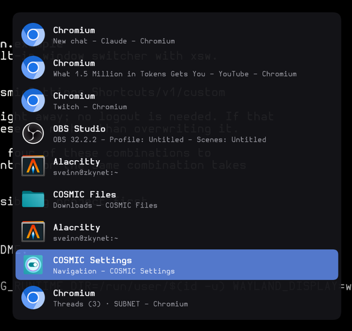

# xsw

A window switcher for the COSMIC desktop. A centered vertical list of open
windows, each with its icon, application name and window title.



## Why it is COSMIC-specific

Listing windows on Wayland is portable; focusing one is not.
`ext-foreign-toplevel-list-v1` reports every toplevel's app id and title but
deliberately offers no way to raise one. cosmic-comp does not implement
`wlr-foreign-toplevel-management`, so the only route to focusing a window is
COSMIC's own pair of protocols: `zcosmic_toplevel_info_v1.get_cosmic_toplevel`
upgrades a foreign handle, and `zcosmic_toplevel_manager_v1.activate` focuses
it. That is what ties xsw to cosmic-comp rather than to wlroots generally.

## Install

```bash
cargo build --release
install -Dm755 target/release/xsw ~/.local/bin/xsw
```

Building needs `libxkbcommon` and its headers (`libxkbcommon-devel`,
`libxkbcommon-dev`, or `libxkbcommon` on Arch). At runtime any Wayland desktop
already has the library.

## Replacing COSMIC's switcher

COSMIC ships `Alt+Tab`, `Alt+Shift+Tab`, `Super+Tab` and `Super+Shift+Tab`
bound to its built-in `System(WindowSwitcher)`. A custom entry for the same
combination takes precedence, so binding those four to xsw is what replaces it.

Copy `cosmic-shortcuts.ron.example` to
`~/.config/cosmic/com.system76.CosmicSettings.Shortcuts/v1/custom`, editing the
paths, or write it directly:

```ron
{
    (modifiers: [Alt], key: "Tab"): Spawn("/home/you/.local/bin/xsw"),
    (modifiers: [Alt, Shift], key: "Tab"): Spawn("/home/you/.local/bin/xsw --prev"),
    (modifiers: [Super], key: "Tab"): Spawn("/home/you/.local/bin/xsw"),
    (modifiers: [Super, Shift], key: "Tab"): Spawn("/home/you/.local/bin/xsw --prev"),
}
```

cosmic-comp reloads the file immediately; no logout is required. Use an
absolute path, because the command is not run through a login shell and
`~/.local/bin` may not be on `PATH`. To revert, empty the file back to `{}`.

If that file already holds shortcuts of your own, merge these entries in
instead of overwriting it.

## Use

Flick the binding — press and release it quickly — and you switch straight to
the previously used window with nothing drawn on screen at all, so flicking
repeatedly toggles between your two most recent windows the way Alt-Tab is
expected to.

Hold the binding down instead and the list appears. Nothing is painted until
either a held modifier is reported or the modifier is released, which is what
keeps a flick silent: by the time xsw has keyboard focus the modifier is
usually already released, so it commits without ever putting a surface on
screen.

`debounce_ms` covers the remaining case, where the modifier is *still* down at
that moment and the list would flash up for a few frames before committing. It
is `0` by default, meaning draw as soon as a held modifier is reported; set it
to a few hundred milliseconds if you see that flash, at the cost of a
deliberate hold waiting that long before the list appears. Cycling works
throughout either way — presses move the selection, they are just not drawn
yet.

Each further press moves the selection one row; releasing the modifier focuses
the highlighted window.

While the list is up:

| Key | Action |
|-----|--------|
| the binding again | next window (`--prev` variant: previous) |
| `Down` / `j` / `n` | next window |
| `Up` / `k` / `p` | previous window |
| `Home` / `End` | first / last window |
| `Enter` / `Space` | focus the highlighted window |
| `Escape` / `q` | cancel without changing focus |

Releasing the modifier is the normal way to commit, but `Enter` and `Escape`
always work.

The list is ordered most-recently-used first, so the window you were just in
sits at the top and the selection starts on the second row. Every workspace is
covered: focusing a window on another workspace switches to it.

The protocol has no notion of recency, so xsw keeps the order itself. Each run
records which window the compositor reported as focused, and which one it
switched to, in `$XDG_RUNTIME_DIR/xsw-mru-$WAYLAND_DISPLAY`, keyed by the
opaque per-toplevel `identifier` that exists for exactly this purpose. Focus
changes made by clicking a window are picked up too, because the compositor's
own report of what is focused is what gets promoted, not just xsw's own
switches. Windows never yet seen focused sort last, in announcement order.

That file is deliberately in `$XDG_RUNTIME_DIR`: the identifiers only mean
anything while the compositor that issued them is running, and the directory is
emptied when the session ends. Deleting it just costs you one cycle of
ordering.

## Configuration

`~/.config/xsw/config.yaml`, every key optional. `config.yaml.example` in this
directory documents all of them; the interesting ones:

```yaml
width: 360              # centered on the active output
max_rows: 20            # rows before the list scrolls
display: primary        # active | primary | an output name like HDMI-A-1
windows: all            # all, or primary to list only that display's windows
theme: system           # dark | light | system (COSMIC's own setting)
show_titles: true       # false gives a compact, name-only list
mru: true               # most-recently-used ordering
debounce_ms: 0          # hold this long before the list is drawn
max_lifetime_secs: 30   # safety cap on the keyboard grab

layout:                 # all logical pixels, scaled by the output factor
  row_height: 46
  icon_size: 30
  padding: 10
  icon_gap: 10
  corner_radius: 4.0
  row_corner_radius: 4.0
  name_size: 14.5
  title_size: 12.0

colors:                 # "#rrggbb" or "#rrggbbaa"; omit any to keep the default
  selection: "#5a82dceb"
```

Four layers, each overriding the one before: built-in defaults, then COSMIC's
own settings (icon theme, interface font, dark/light), then this file, then
command line flags. So xsw follows the desktop unless you say otherwise, and
`--dark` on one binding does not require editing the file.

`xsw --dump-config` prints the values actually in effect, and its output is
itself a valid config file, so it doubles as a starting point:

```bash
mkdir -p ~/.config/xsw && xsw --dump-config > ~/.config/xsw/config.yaml
```

A typo is reported on stderr and the file is then ignored rather than being
fatal — xsw usually runs from a keybinding with no terminal, and refusing to
start would present as "Alt-Tab stopped working" with nothing to explain it.
Unknown keys are rejected rather than silently skipped, because a key that is
quietly ignored looks exactly like a feature that does not work:

```console
$ xsw --dump-config
xsw: ignoring /home/you/.config/xsw/config.yaml: unknown field `wdith`,
expected one of `width`, `max_rows`, `theme`, `font`, ...
```

### Which display it appears on

`display` takes one of three things:

| Value | |
|-------|--|
| `primary` | the display COSMIC marks as primary, the same one Settings and `cosmic-randr list` call the Xwayland primary. The default |
| `active` | the display holding the focused window — the compositor's own choice |
| an output name | a specific display, e.g. `HDMI-A-1`; `cosmic-randr list` names them |

Wayland core has no notion of a primary display and `wl_output` says nothing
about it, so `primary` is read from COSMIC's own `xwayland_primary` flag on
`zcosmic_output_head_v1`. Reaching that means going through
`wlr-output-management`, since a cosmic head is obtained by upgrading a
`zwlr_output_head_v1` — the same pattern the toplevel protocols use. Guessing
"the leftmost output" would have been much less code and is right on most
setups, but it breaks the moment a primary display sits in the middle of a row.

Those protocols are bound only for `display: primary`, and the wait for them is
folded into the wait for window state that happens anyway, so it costs
essentially nothing; `active` avoids the globals entirely if you want the
last word in startup latency. If the wanted display cannot be
found — unplugged, renamed, or a compositor that reports no primary — xsw says
so on stderr and falls back to the active display, since appearing in the wrong
place beats not appearing.

### Listing only one display's windows

`windows: primary` drops everything that does not belong to the primary
display. It is a separate axis from `display`, which only decides where the
switcher is drawn.

```yaml
display: primary   # draw it on the primary display
windows: primary   # and only list windows that live there
```

"Belonging to" is doing real work in that sentence. The protocol describes
`output_enter` on a toplevel as the window becoming *visible* on an output,
which would have made this a visibility filter — and since COSMIC workspaces
are per-display, that would have made windows on the primary's other
workspaces unreachable. Testing cosmic-comp directly showed otherwise: a
window keeps its output both when minimized and when parked on an inactive
workspace of that display. So `primary` means everything that lives on that
display, and activating one of those windows switches workspace as usual.

Two consequences worth knowing:

- Windows on your **other** displays become unreachable from the switcher.
  Bind a second key to `xsw --windows all` if you want an escape hatch.
- If the primary has no windows, or is unplugged, or the compositor reports no
  primary, xsw says so on stderr and lists everything instead. A keybinding
  that silently does nothing reads as broken; too many windows is the milder
  failure.

Focus history is recorded before the filter runs, so focusing a window on
another display is still remembered and most-recently-used ordering does not
drift when the filter is on.

### Title rules

Rewrites what is shown for windows whose title contains a substring. Mainly for
browser-hosted applications, which report the browser's app id and a title like
`Slack - MinioHQ - Slack - Chromium`:

```yaml
title_rules:
  - contains: "Slack"
    title: "Slack"
    name: "Slack"
```

turns that row from

```
Chromium
* hack (Channel) - MinioHQ - Slack - Chromium
```

into

```
Slack
Slack
```

| Key | |
|-----|--|
| `contains` | substring to look for in the window title (required) |
| `title` | title to show instead (required) |
| `name` | application name to show instead of the desktop entry's |
| `icon` | icon name to show instead of the application's |
| `app_id` | only apply to windows with this exact app id |
| `case_sensitive` | match `contains` exactly as written (default `false`) |

Matching is case-insensitive by default and the first matching rule wins, so
put the specific ones first. `app_id` narrows a rule so it cannot catch, say, a
text editor that happens to have "Slack" in a file name. An `icon` that does
not resolve in any installed theme is ignored, leaving the real icon rather
than a blank space.

## Options

```
      --prev             cycle backwards; bind this to the shift variant
      --list             print the window list to stdout and exit
      --dump-config      print the resolved configuration and exit
      --config <path>    read this config file instead of the default
      --width <px>       width of the switcher
      --max-rows <n>     rows shown before scrolling
      --display <d>      active, primary, or an output name like HDMI-A-1
      --windows <w>      all, or primary to list only the primary display's
      --icon-theme <s>   icon theme to search
      --font <family>    font family
      --dark, --light    force a palette
  -h, --help             print this help
  -V, --version          print the version
```

`--list` prints `app_id`, title and state as tab-separated columns, which is
useful for checking what the compositor is reporting:

```console
$ xsw --list
chromium	Twitch - Chromium	-
Alacritty	sveinn@zkynet:~	active
com.system76.CosmicFiles	Downloads — COSMIC Files	-
```

## How the key handling works

Two compositor behaviours shape the design, both measured on cosmic-comp 1.7
rather than assumed:

**A bound combination never reaches the switcher.** A compositor keybinding
outranks an exclusive layer-shell keyboard grab. With `Alt+Tab` bound, holding
Alt and pressing Tab delivers no key event to xsw at all: cosmic-comp consumes
the combination and runs the bound command again. An unbound combination such
as `Alt+j` arrives normally.

So cycling with the binding's own key is driven by process rather than by
keystroke. The first invocation binds a socket in `$XDG_RUNTIME_DIR` and draws
the list; every later one connects, says which direction to move, and exits.
Forwarding a keystroke that way takes about a millisecond, so held-key repeat
keeps up.

**Focus information is destroyed by taking the grab.** While the switcher holds
an exclusive keyboard grab, no toplevel reports itself as activated. The
focused window therefore has to be captured *before* the overlay is mapped,
which is why xsw waits briefly for the compositor to report toplevel state at
startup: cosmic-comp emits it on its own refresh cycle rather than in reply to
a request, so there is nothing to synchronise on but time.

One more quirk is worth knowing about, since it caused a hang during
development: the pressed-key list delivered with keyboard focus is not reliable
here. cosmic-comp has been seen listing a modifier keycode in it while the
`modifiers` event sent with the same serial reports nothing held. xsw ignores
that list and trusts only `modifiers`, and it arms on any report of a held
modifier rather than just the first, because both orderings occur.

That same `modifiers` event is what makes flicking work. cosmic-comp grants
keyboard focus to a layer surface before it has any buffer attached — the
`enter` and `modifiers` events arrive ahead of the first `configure` — so xsw
can learn whether a modifier is still down *before* deciding to paint. If none
is, the binding was flicked and already released, and it commits and exits
having drawn nothing, which is why a quick Alt-Tab leaves no list on screen. If
the compositor ever fails to report modifier state at all, a 100 ms backstop
paints the list anyway: visible and dismissible is a better failure than an
invisible keyboard grab.

As a last resort the switcher closes itself after 30 seconds. That is a safety
net, not a feature: an exclusive grab that never ends would leave the session
unable to type.
